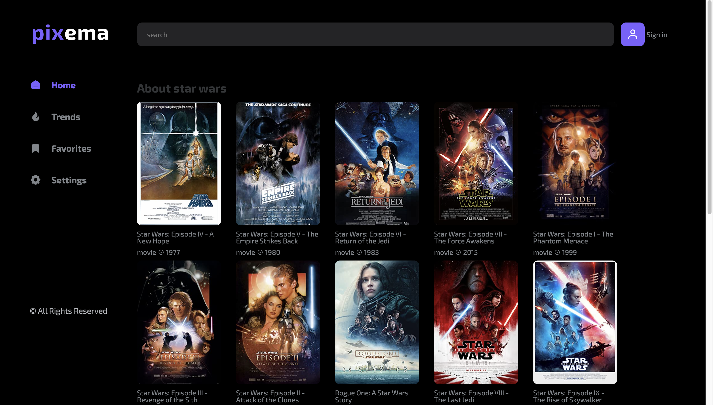
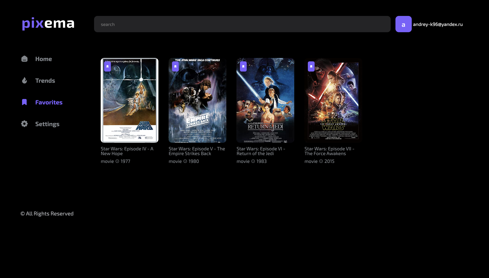
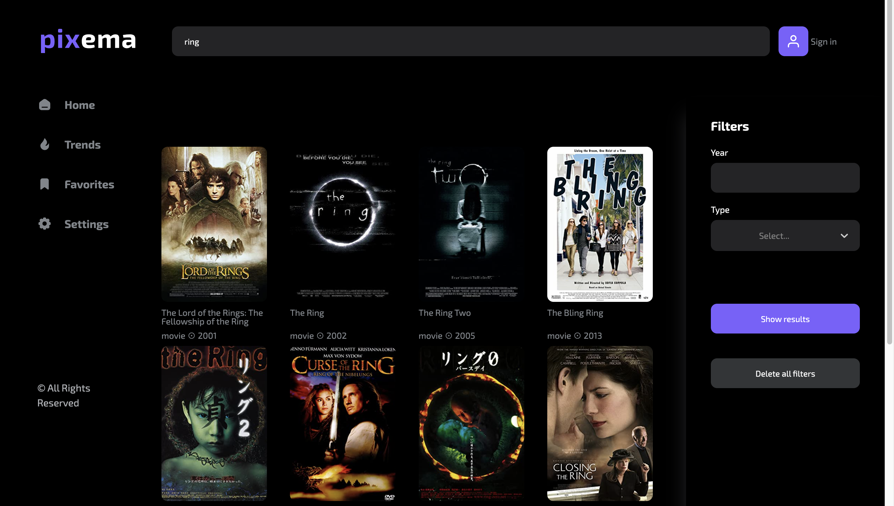
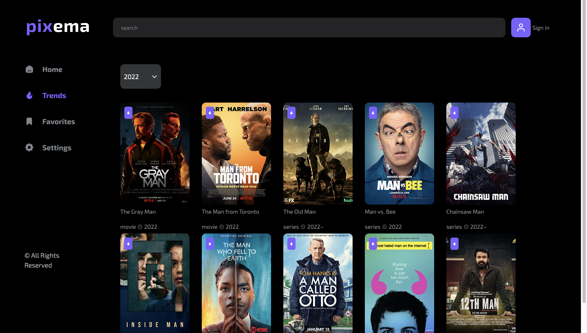

<!-- PROJECT LOGO -->
 

  

  <h3 align="center">Pixema app</h3>

  

    A web application based on an existing API to search for movies.
     
    <a href="https://andreykokorenko.github.io/react-pixema-app/" target="_blank">View Demo</a>

<!-- TABLE OF CONTENTS -->

  
Table of Contents

  <ol>
    <li>
      <a href="#about-the-project">About The Project</a>
      <ul>
        <li><a href="#built-with">Built With</a></li>
      </ul>
    </li>
    <li>
      <a href="#getting-started">Getting Started</a>
      <ul>
        <li><a href="#prerequisites">Prerequisites</a></li>
      </ul>
    </li>
    <li><a href="#usage">Usage</a></li>
    <li><a href="#contributing">Contributing</a></li>
    <li><a href="#contact">Contact</a></li>
  </ol>

<!-- ABOUT THE PROJECT -->

## About The Project

It is a movie search application based on an existing API.

- You can log in, register and change password and your email.
- You can add movies to your favorites.
- Favorite movies are stored in localStorage.
- You can see which movies are trends right now
- It is possible to search for films, and filter them by year and type.
- You can also change the color theme of the site.

Use the `npm start` to get started.

### Built With

This is a list of the main libraries that were used in the project:

- [![Typescript][typescriptlang.org]][typescript-url]
- [![React][react.js]][react-url]
- [![Axios][axios-http.com]][axios-url]
- [![Firebase][firebase.google.com]][firebase-url]
- [![Redux Toolkit][redux-toolkit.js.org]][redux-url]
- [![React Hook Form][react-hook-form.com]][react-hook-form-url]
- [![React Router][reactrouter.com]][react-router-url]
- [![styled-components][styled-components]][styled-components-url]
- [![Framer Motion][framer.com]][framer-url]
- [![React Select][react-select.com]][react-select-url]

(<a href="#readme-top">back to top</a>)

<!-- GETTING STARTED -->

## Getting Started

Use the `npm start` to get started.

### Prerequisites

Use the `npm i` to install all libraries.

<!-- USAGE EXAMPLES -->

## Usage

When you open the app, you will be taken to the home page with various categories. There are 10 films in each category. As the page scrolls, new categories will be added.

If you are not a registered user and go to the favorites or settings tab, you will be automatically redirected to the login tab.

After registration or authorization, you can go to your favorite films, if any.

You can use the category search by writing the name of the movie in the search bar.

By going to the trends section, you will see popular films.

And in the settings section, you can change the password or change the theme of the site.

<!-- CONTRIBUTING -->

## Contributing

If you have a suggestion that would make this project better, please fork the repo and create a pull request. You can also simply open an issue with the tag "enhancement".
Don't forget to give the project a star! Thanks again!

1. Fork the Project
2. Create your Feature Branch (`git checkout -b feature/AmazingFeature`)
3. Commit your Changes (`git commit -m 'Add some AmazingFeature'`)
4. Push to the Branch (`git push origin feature/AmazingFeature`)
5. Open a Pull Request

<!-- CONTACT -->

## Contact

AndreyKokorenko - andreikokorenko@yandex.by
 
[telegram](https://t.me/AndreyKokorenko)

Project Link: [https://github.com/AndreyKokorenko/react-pixema-app](https://github.com/AndreyKokorenko/react-pixema-app)

(<a href="#readme-top">back to top</a>)

[typescriptlang.org]: https://img.shields.io/badge/-Typescript-blue?style=for-the-badge&logo=typescript&logoColor=white
[typescript-url]: https://www.typescriptlang.org/
[react.js]: https://img.shields.io/badge/React-20232A?style=for-the-badge&logo=react&logoColor=61DAFB
[react-url]: https://reactjs.org/
[axios-http.com]: https://img.shields.io/badge/-axios-671ddf?style=for-the-badge&logo=axios&logoColor=white
[axios-url]: https://axios-http.com/ru/docs/intro
[firebase.google.com]: https://img.shields.io/badge/-firebase-5f6368?style=for-the-badge&logo=firebase&logoColor=orange
[firebase-url]: https://firebase.google.com/docs/
[redux-toolkit.js.org]: https://img.shields.io/badge/-redux--toolkit-764abc?style=for-the-badge&logo=redux&logoColor=white
[redux-url]: https://redux-toolkit.js.org/
[react-hook-form.com]: https://img.shields.io/badge/-react--hook--form-1e2a4a?style=for-the-badge&logo=react-hook-form&logoColor=ec5990
[react-hook-form-url]: https://react-hook-form.com/
[github.com/rt2zz/redux-persist]: https://img.shields.io/badge/-redux--persist-persist?style=for-the-badge
[styled-components]: https://img.shields.io/badge/-styled--components-35495E?style=for-the-badge&logo=styled-components&logoColor=pink
[styled-components-url]: https://styled-components.com/
[framer.com]: https://img.shields.io/badge/-framer--motion-DD0031?style=for-the-badge&logo=framer&logoColor=black
[framer-url]: https://www.framer.com/
[react-select.com]: https://img.shields.io/badge/-react--select-FF3E00?style=for-the-badge
[react-select-url]: https://react-select.com/home
[reactrouter.com]: https://img.shields.io/badge/-react--router-563D7C?style=for-the-badge&logo=react-router&logoColor=white
[react-router-url]: https://reactrouter.com/
